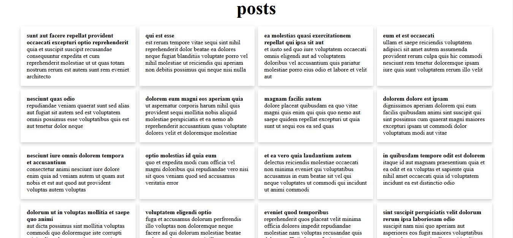

# Dynamic Card Display

This webpage fetches data and displays titles and descriptions in a card layout, using HTML, CSS, and JavaScript. Each card displays specific information in a clean, responsive format.

## Features

- **Dynamic Data Fetching**: Fetches data for titles and descriptions, then displays them as individual cards.
- **Card Layout**: Responsive card styling for a modern and clean look.
- **Responsive Design**: Works well on both desktop and mobile devices.

## Technologies Used

- **HTML**: Structure for the card layout.
- **CSS**: Styling for cards, layout, and responsiveness.
- **JavaScript**: Fetches data and populates cards dynamically.

